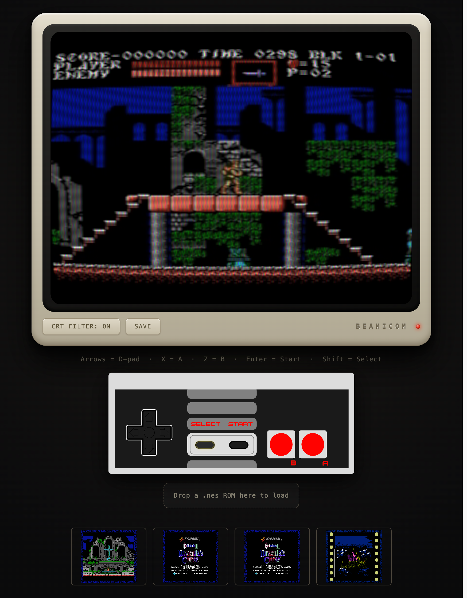

# BeamicomPhx

Web client for the [`beamicom`](../beamicom/README.md) NES
emulator. A Phoenix LiveView app that streams a running console's audio/video
to the browser over WebRTC and relays controller input back.

It is one of the three projects in the combined
[Beamicom repository](../README.md):

```
beamicom/          # core emulator (headless)
beamicom_scenic/   # desktop client — Scenic/OpenGL window
beamicom_phx/      # this project — browser client
```



## Modes

The app runs in one of two modes set by the `BEAMICOM_MODE` env var (default: `server`).

| Mode | What it does |
|------|-------------|
| `server` | Runs the emulator locally, encodes A/V with FFmpeg/Opus, and streams it to every connected browser over WebRTC. Accepts ROM drops and controller input from the browser. |
| `client` | Attaches to a running server node's A/V relay and sends browser controls to that server over a Phoenix Channel. No local emulator or ROM drop. |

## Setup

The local `beamicom` path dependency is already included in the repository:

```
beamicom/         # core dependency
beamicom_stream/  # shared Membrane A/V and RTP components
beamicom_phx/     # this project
```

From the repository root:

```sh
cd beamicom_phx
mix setup           # deps + assets
```

## Running

### Server mode

```sh
BEAMICOM_ROM=roms/game.nes mix phx.server
```

`BEAMICOM_ROM` is required in server mode — the emulator starts at boot with
that ROM. You can swap ROMs at runtime by dragging a `.nes` file onto the drop
zone in the browser.

Default port: **4044**.

### Client mode

Start the server with an RTP target pointing at the client machine:

```sh
BEAMICOM_ROM=roms/game.nes \
BEAMICOM_IP=0.0.0.0 \
BEAMICOM_RTP_TARGET=CLIENT_IP:5000 \
mix phx.server
```

Then start the client with the browser-reachable URL of the server:

```sh
BEAMICOM_MODE=client \
BEAMICOM_IP=0.0.0.0 \
BEAMICOM_SERVER_URL=http://SERVER_IP:4044 \
mix phx.server
```

Default port: **4046**. Open `http://CLIENT_IP:4046`. A/V arrives over RTP on
UDP ports 5000 (AV1 video) and 5002 (Opus audio); controls go from the browser
to `ws://SERVER_IP:4044/controller/websocket` as a standard Phoenix Channel and
are forwarded by the server to Beamicom's EI Unix-socket input server. Allow
those ports through any host firewall. `BEAMICOM_RTP_LISTEN` changes the base
UDP port; audio always uses base + 2.

`BEAMICOM_IP=0.0.0.0` makes the development endpoint reachable from other
machines; omit it when both processes and the browser run on one host. The
controller channel is intended for a trusted local network and does not require
authentication.

The reusable RGB/PCM sources, AV1 packetizer, RTP timestamp/serialization code,
and AV1/Opus UDP broadcaster live in `beamicom_stream`. This project keeps the
Phoenix UI, browser controls, WebRTC signaling/sink, and client relay.

## Browser UI

- **Video** — CRT-styled 4:3 WebRTC stream, unmuted on first key/pointer press
  (browsers block autoplay audio).
- **Controller** — keyboard bindings and an on-screen touch gamepad. In client
  mode, input is relayed to the server selected by `BEAMICOM_SERVER_URL`.

| Key | NES button |
|-----|------------|
| Arrow keys | D-pad |
| X | A |
| Z | B |
| Enter | Start |
| Shift | Select |

- **ROM drop zone** *(server mode only)* — drag a `.nes` file onto the labelled
  area at the bottom of the page to (re)load the emulator. All connected
  browsers pick up the new game immediately.
