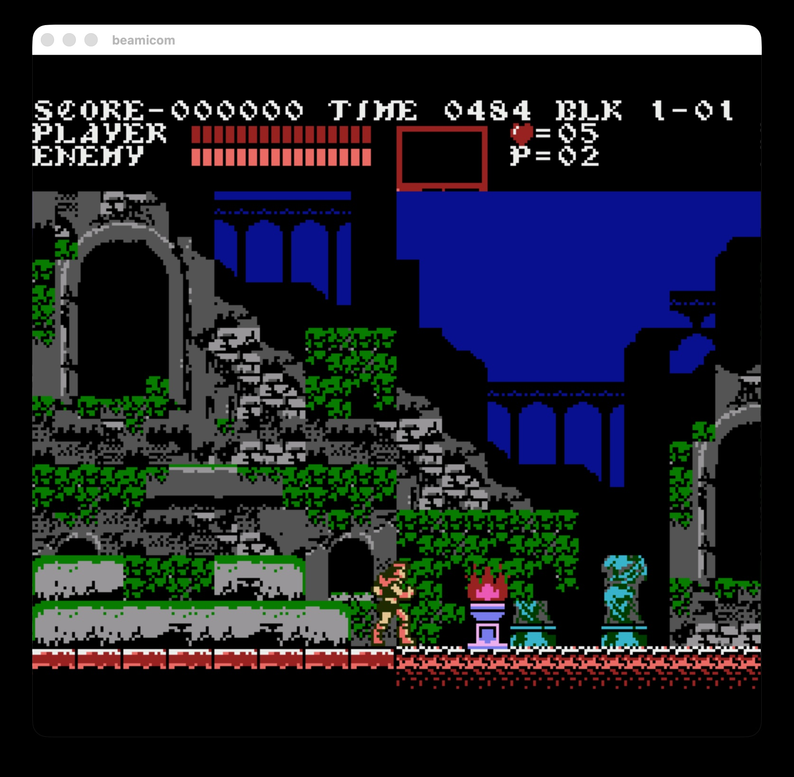

# BeamicomScenic

Local-verification client for the
[`beamicom`](../beamicom/README.md) NES emulator: a
[Scenic](https://hexdocs.pm/scenic) window that renders frames from
`Beamicom.NES.Output` and plays audio through `Beamicom.NES.AudioSink` (ffplay).
Keeping it in a separate project means the core emulator has no Scenic / OpenGL
dependencies.



## Installation

The `scenic_driver_local` window uses native GLFW/GLEW + OpenGL, so those must be
installed before fetching dependencies.

### macOS

```sh
brew install glfw glew pkg-config
```

`scenic_driver_local`'s native build finds them via `pkg-config`. If compilation
can't locate GLFW/GLEW, point `PKG_CONFIG_PATH` at Homebrew's `.pc` files:

```sh
export PKG_CONFIG_PATH="/opt/homebrew/lib/pkgconfig:/opt/homebrew/opt/glew/lib/pkgconfig"
```

Audio playback shells out to `ffplay` (part of ffmpeg); it's optional — the sink
declines gracefully if it's missing:

```sh
brew install ffmpeg
```

### Linux (Debian/Ubuntu)

```sh
sudo apt install pkg-config libglfw3-dev libglew-dev ffmpeg
```

### Fetch and compile

This project and its `beamicom` path dependency are included in the same
repository:

```
beamicom/          # core emulator
beamicom_scenic/   # this project
```

From the repository root:

```sh
cd beamicom_scenic
mix deps.get
mix compile
```

## Usage

```sh
iex -S mix
```
```elixir
Beamicom.NES.Scenic.play("../beamicom/roms/game.nes")
Beamicom.NES.Scenic.play("../beamicom/roms/game.nes", scale: 4)   # integer scale, default 3
Beamicom.NES.Scenic.play("../beamicom/roms/game.nes", speed: 0.5) # glitch-free slow motion, default 1.0
```

### Controls (player 1)

| Key | Button |
|-----|--------|
| Arrow keys | D-pad |
| `X` | A |
| `Z` | B |
| Enter | Start |
| Right Shift | Select |

Debug keys: `Space` pause/resume, `.` step one frame while paused, `g` toggle the
raw palette-address grayscale view.
